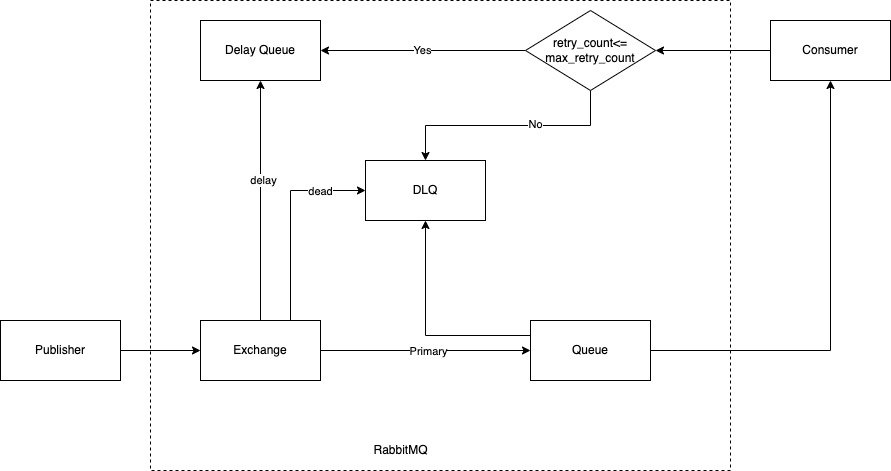

# @rachuta/rabbitmq-wrapper Architecture.
## Introduction
@rachuta/rabbitmq-wrapper is built on top of [amqplib][1] library and @rachuta/rabbitmq-wrapper tries to solve below list of problems which are required in production run. At present @rachuta/rabbitmq-wrapper supports worker queue pattern.

* Move message to DLQ when unable to process the message by the consumer.
* Retry messages with delay when consumer fail to process the message.
* Connection recovery on network failures(this is pending)

## Architecture.
@rachuta/rabbitmq-wrapper consumers only create the queues; @rachuta/rabbitmq-wrapper will create one exchange and three queues for one consumer

i.e, when consumer listen on queue `notification.send.sms`, this wrapper creates one delay queue named `notification.send.sms.delay` and one `notification.send.dlq` queue for DLQ; and all queues are bind with `notification.send.sms.exchange` direct exchange with keys `primary`, `delay` and `dead` mapped to the queues respectively.



```Note
@rachuta/rabbitmq-wrapper publisher can't create queues, so we recommend deploying consumers before publishers.
```
## About RabbitMQ

RabbitMQ is a message broker used for processing async tasks or systems with event driven approach to process messages. RabbitMQ is famous for two patterns.

* Worker queue pattern.
* Publisher/Subscriber pattern(fanout).

### Worker Queue pattern
Publishers send messages to a single queue, and RabbitMQ distributes the messages to the consumer round robin.

### Publisher/Subscriber pattern
The publisher sends the message to a queue, and all consumers subscribed to the queue will get the message.


### Tech Talk.

[Video presentation][3]
[Presentation slides][4]

Please look [RabbitMQ tutorials][2] for a better understanding.

[1]: https://github.com/amqp-node/amqplib
[2]: https://www.rabbitmq.com/getstarted.html
[3]: https://drive.google.com/file/d/15Zi1wAZ5oM-UrsCTcLjvPhlxcriM-AKB/view?usp=sharing
[4]: https://docs.google.com/presentation/d/1mX4c5-HJTSKm7oF0ZuMLxltZOAV9i3E4ZD3-7aq2lMU/edit?usp=sharing
